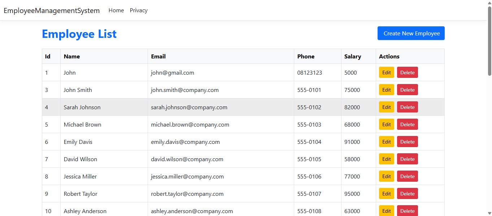
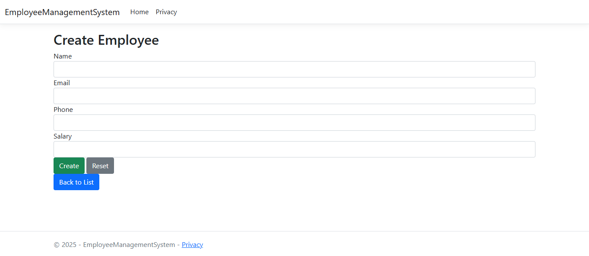
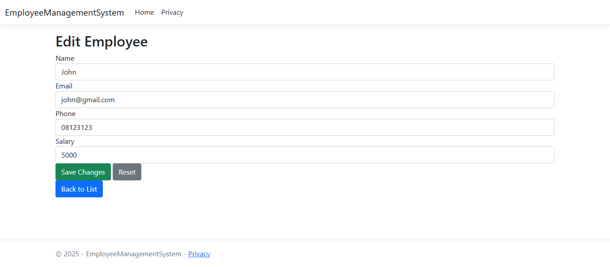

# Employee Management System

A simple ASP.NET Core MVC application (.NET 8, C# 12) that demonstrates CRUD operations for managing employees using Entity Framework Core with SQL Server and Bootstrap styling.

## Features
- List employees
- Create new employee
- Edit existing employee
- Delete employee
- Server-side validation via non-nullable reference types and anti-forgery tokens

## Tech Stack
- ASP.NET Core MVC (.NET 8)
- Entity Framework Core (SQL Server)
- Bootstrap (from wwwroot/lib)

## Project Structure
- Controllers/EmployeeController.cs — MVC controller with CRUD actions
- Models/Employee.cs — Employee entity (Id, Name, Email, Phone, Salary)
- Data/EmployeeDbContext.cs — EF Core DbContext
- Migrations/ — EF Core migrations
- Views/Employee/ — Razor views for Index, Create, Edit
- Views/Shared/_Layout.cshtml — Layout with Bootstrap
- appsettings.json — Connection strings and logging
- Program.cs — App startup and routing

## Screenshots
#### Index

#### Create

#### Edit

## Prerequisites
- Visual Studio 2022 (latest) or .NET SDK 8.0+
- SQL Server (LocalDB or SQL Server Express/Instance)
- EF Core tools (optional for CLI):
  - dotnet tool install --global dotnet-ef

## Getting Started

1) Clone and open the solution in Visual Studio 2022.

2) Configure the database connection.
   - Edit appsettings.json:
     - ConnectionStrings:Default
     - Example (update server/instance as needed):
       "Server=YOUR_SERVER\\\SQLEXPRESS;Database=EmployeeDb;Trusted_Connection=True;TrustServerCertificate=True"

3) Apply database migrations.
   - Using Package Manager Console (recommended in VS):
     - __Tools > NuGet Package Manager > Package Manager Console__
     - Update-Database
   - Or using CLI:
     - dotnet ef database update

4) Run the application.
   - In Visual Studio: __Build > Build Solution__ then __Debug > Start Debugging__ (F5)
   - Or CLI: dotnet run
   - Default route goes to /Employee/Index

## Usage

Routes:
- GET /Employee — list employees
- GET /Employee/Create — create form
- POST /Employee/Create — create submit
- GET /Employee/Edit/{id} — edit form
- POST /Employee/Edit — edit submit
- GET /Employee/Delete/{id} — delete

Model:
- Employee: Id (int), Name (string), Email (string), Phone (string), Salary (int)
- Strings are non-nullable; database enforces required columns.

## Configuration Notes
- Program.cs configures MVC with default route to Employee/Index.
- Anti-forgery is enabled on POST actions via [ValidateAntiForgeryToken].
- Authentication/authorization middleware is present but no schemes are configured.

## Troubleshooting
- SQL connection errors: verify server/instance and permissions in appsettings.json.
- No migrations found: create one with
  - Add-Migration Initial (PMC) or dotnet ef migrations add Initial (CLI), then Update-Database.
- Static assets not loading: ensure wwwroot/lib/bootstrap is restored (use LibMan or confirm files exist).

## Next Steps
- Add data annotations (e.g., [Required], [EmailAddress], [StringLength]) to Employee model for richer validation.
- Add Details view/action and confirmation for Delete.
- Add authentication/authorization.
- Add paging/search/sort on the employee list.
